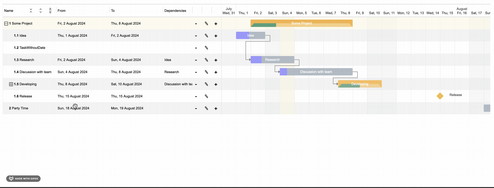

# gantt-task-react

## Interactive Gantt Chart for React with TypeScript.

A highly customizable and interactive Gantt chart component for React with TypeScript support. This repository
integrates features and enhancements from the
original [`MaTeMaTuK/gantt-task-react`](https://github.com/MaTeMaTuK/gantt-task-react) ,
the [`ObeoNetwork/gantt-task-react`](https://github.com/ObeoNetwork/gantt-task-react) fork, and our current development,
creating a comprehensive solution for managing Gantt charts.



## Key Features

- **Performance Improvements**: Optimized rendering to handle large datasets efficiently, ensuring smooth user
  interactions.
- **Enhanced Customization**: Allows for more extensive task styling options to match brand-specific requirements.
- **TypeScript Integration**: Improved type definitions for safer and more efficient development workflows.
- **Responsive Design**: Improved mobile and tablet support for better usability across different devices.
- **Dependency Management**: Enhanced task dependency features, allowing for more complex project planning scenarios.
- **Advanced Timeline Navigation**: Features smooth navigation across different timeframes like months and weeks.
- **Localization Support**: Offers localization for various languages and date formats.
- **Event Handling**: Supports comprehensive event handling for interactive features.
- **QuarterYear View Mode**: Supports viewing tasks in quarterly segments, providing a flexible timeline view.
- **PIC label & avatar**: Optional `shortName` (assignee) and `avatarUrl` show as `name · PIC` in the task list and on bars (with photo when space allows).
- **Parent span from children**: `isUpdateDisabledParentsOnChange` (default `true`) recalculates parent `start`/`end` from direct children when dates change; use `isDisabled: true` on a parent for live bar updates while dragging. Helper `syncParentDateRangeFromChildren` syncs imported or external data.

### Enhancement Summary

This repository combines the foundational work of `MaTeMaTuK/gantt-task-react` with enhancements from `ObeoNetwork`,
including better integration with TypeScript, improved rendering performance for large datasets, and new customization
options for task styling. The project is further developed in this fork, focusing on additional usability improvements
and feature expansions.

## Installation

Install the package using npm:

```bash
npm install @wamra/gantt-task-react
```

## How to use it

```javascript
import { Gantt, Task, EventOption, StylingOption, ViewMode, DisplayOption } from '@wamra/gantt-task-react';
import "@wamra/gantt-task-react/dist/style.css";

let tasks: Task[] = [
  {
    start: new Date(2020, 1, 1),
    end: new Date(2020, 1, 2),
    name: 'Idea',
    id: 'Task 0',
    type: 'task',
    progress: 45,
    isDisabled: true,
    styles: { progressColor: '#ffbb54', progressSelectedColor: '#ff9e0d' },
  },
  ...
];
<Gantt tasks={tasks}/>
```

You may handle actions

```javascript
<Gantt
  tasks={tasks}
  viewMode={view}
  onDateChange={onTaskChange}
  onTaskDelete={onTaskDelete}
  onProgressChange={onProgressChange}
  onDoubleClick={onDblClick}
  onClick={onClick}
/>
```

### Task label: title and PIC (`shortName`, `avatarUrl`)

`name` is always the main title. If `shortName` is set, the UI shows **`{name} · {shortName}`** (task/project title · PIC). `avatarUrl` is an optional image URL shown in the task list and on the bar when the bar is wide enough.

```typescript
import { Gantt, Task, formatTaskTitleWithPic } from "@wamra/gantt-task-react";

const task: Task = {
  id: "1",
  type: "task",
  name: "Design review — sprint 2",
  shortName: "Ana",
  avatarUrl: "https://example.com/avatars/ana.jpg",
  start: new Date(),
  end: new Date(),
  progress: 50,
};

// Same string as used on bars / list (for custom columns or tests):
formatTaskTitleWithPic(task.name, task.shortName); // "Design review — sprint 2 · Ana"
```

### Parent dates following children

- **`isUpdateDisabledParentsOnChange`** (default `true`): When a child’s dates change, each ancestor’s `start`/`end` is recomputed as the min/max of **direct** children’s dates, and included in `onChangeTasks` updates.
- **`isDisabled: true`** on a parent: The parent bar is not dragged manually; while a child is dragged, the parent’s displayed range can follow in real time (see `useGetTaskCurrentState` in the library).
- **`syncParentDateRangeFromChildren(tasks)`**: Call after loading tasks from an API or when children were edited outside the chart so parents match the children’s span (handles cycles safely).

```typescript
import { syncParentDateRangeFromChildren } from "@wamra/gantt-task-react";

const tasks = syncParentDateRangeFromChildren(rawTasks);
```

### Exported helpers

| Export                         | Purpose |
| ------------------------------ | ------- |
| `formatTaskTitleWithPic`       | Builds `name · shortName` when `shortName` is set. |
| `syncParentDateRangeFromChildren` | `(tasks: TaskOrEmpty[]) => TaskOrEmpty[]` — sets each parent’s `start`/`end` from direct children (deepest parents first). |

## Pengembangan lokal (React 18+)

Persyaratan: Node.js 18 atau lebih baru.

Dari root repositori, pasang dependensi (termasuk workspace `playground`):

```bash
npm install
```

### Build library

```bash
npm run build
```

Keluaran ada di folder `dist/` (`gantt-task-react.es.js`, `gantt-task-react.umd.js`, `style.css`, deklarasi TypeScript).

### Unit test (Vitest)

```bash
npm run test:unit
```

Mode watch:

```bash
npm run test:watch
```

Lint + unit test + build (CI lokal):

```bash
npm test
```

### Playground (Vite + React 18)

Aplikasi demo mengimpor sumber langsung dari `src/` sehingga perubahan pada library langsung terlihat tanpa `npm run build` berulang.

```bash
npm run playground
```

Buka `http://localhost:5174` (atau URL yang ditampilkan di terminal).

### Storybook (dokumentasi interaktif)

```bash
npm run storybook
```

## Gantt Configuration

### GanttProps

| Parameter Name                  | Type          | Description                                        |
| :------------------------------ | :------------ | :------------------------------------------------- |
| tasks\*                         | [Task](#Task) | An array of tasks to display in the Gantt chart.   |
| viewMode                        | ViewMode      | Specifies the time scale for the chart.            |
| onDateChange                    | function      | Callback when a task's start or end date changes.  |
| onProgressChange                | function      | Callback when a task's progress changes.           |
| onDoubleClick                   | function      | Callback when a task is double-clicked.            |
| onClick                         | function      | Callback when a task is clicked.                   |
| rtl                             | boolean       | Right-to-left display mode.                        |
| locale                          | Locale        | Localization for date and time formatting.         |
| barBackgroundColor              | string        | Background color of task bars.                     |
| barProgressColor                | string        | Color of the task bar's progress indicator.        |
| projectBackgroundColor          | string        | Background color for project tasks.                |
| milestoneBackgroundColor        | string        | Background color for milestone tasks.              |
| todayColor                      | string        | Color of the "today" indicator line.               |
| arrowColor                      | string        | Color of dependency arrows.                        |
| fontFamily                      | string        | Font family for the chart.                         |
| fontSize                        | string        | Font size for text within the chart.               |
| rowHeight                       | number        | Height of each row.                                |
| columnWidth                     | number        | Width of each time unit column.                    |
| ganttHeight                     | number        | Total height of the Gantt chart.                   |
| ganttWidth                      | number        | Total width of the Gantt chart.                    |
| taskHeight                      | number        | Height of task bars within each row.               |
| dependencies                    | boolean       | Display task dependencies as arrows.               |
| taskListCellWidth               | string        | Width of the task list cell. Empty to hide.        |
| dragStep                        | number        | Time step for dragging actions, in milliseconds.   |

### EventOption

| Parameter Name     | Type                                                                          | Description                                                                             |
| :----------------- | :---------------------------------------------------------------------------- | :-------------------------------------------------------------------------------------- |
| onSelect           | (task: Task, isSelected: boolean) => void                                     | Function to execute on taskbar select/unselect event.                                   |
| onDoubleClick      | (task: Task) => void                                                          | Function to execute on taskbar double-click event.                                      |
| onClick            | (task: Task) => void                                                          | Function to execute on taskbar click event.                                             |
| onDelete\*         | (task: Task) => void/boolean/Promise<void>/Promise<boolean>                   | Function to execute on taskbar delete button press event.                               |
| onDateChange\*     | (task: Task, children: Task[]) => void/boolean/Promise<void>/Promise<boolean> | Function to execute when dragging taskbar event on timeline finishes.                   |
| onProgressChange\* | (task: Task, children: Task[]) => void/boolean/Promise<void>/Promise<boolean> | Function to execute when dragging taskbar progress event finishes.                      |
| onExpanderClick\*  | onExpanderClick: (task: Task) => void;                                        | Function to execute on the table expander click.                                        |
| onWheel\*          | onWheel: (wheelEvent: WheelEvent) => void;                                    | Function to execute when the mouse wheel is used.                                       |
| timeStep           | number                                                                        | Time step value for onDateChange. Specify in milliseconds.                              |
| onChangeTasks      | `(nextTasks, action) => void`                                                 | Called when the task list changes (drag, edit, hierarchy, etc.). `action` is `OnChangeTasksAction` (e.g. `date_change`, `add_tasks`). |
| isUpdateDisabledParentsOnChange | boolean | Default `true`. Recalculates parent `start`/`end` from direct children when a child changes. |
| isMoveChildsWithParent | boolean | Default `true`. When moving a group task, moves descendants together.              |

> Chart undoes operation if method returns false or error. Parameter children returns one-level deep records.

### DisplayOption

| Parameter Name      | Type    | Description                                                                                                                             |
| :------------------ | :------ | :---------------------------------------------------------------------------------------------------------------------------------------|
| viewMode            | enum    | Specifies the time scale. Options: Hour, Quarter Day, Half Day, Day, Week(ISO-8601, 1st day is Monday), Month, QuarterYear, Year.       |
| viewDate            | date    | Specifies display date and time for display.                                                                                            |
| preStepsCount       | number  | Specifies empty space before the first task.                                                                                            |
| locale              | string  | Specifies the month name language. Able formats: ISO 639-2, Java Locale.                                                                |
| monthCalendarFormat | string  | Specifies the month display on the calendar.                                                                                            |
| monthTaskListFormat | string  | Specifies the month display on the list.                                                                                                |
| rtl                 | boolean | Sets rtl mode.                                                                                                                          |
| roundDate           |         | Allows customizing the way the date start/end are rounded.                                                                              |
| checkIsHoliday      |         | Tells if a date is a holiday. Impacts the style of the day and the way the date is adjusted to working days.                            |
| dateMoveStep        |         | An object corresponding to a duration. Gives the step to adjust to the working day when moving the date allowing smooth feedback.       |

### StylingOption

| Parameter Name             | Type   | Description                                                                                              |
|----------------------------|--------|----------------------------------------------------------------------------------------------------------|
| headerHeight               | number | Specifies the header height.                                                                             |
| columnWidth                | number | Specifies the time period width.                                                                         |
| listCellWidth              | string | Specifies the task list cell width. Empty string means "no display".                                      |
| rowHeight                  | number | Specifies the task row height.                                                                            |
| barCornerRadius            | number | Specifies the taskbar corner rounding.                                                                    |
| barFill                    | number | Specifies the taskbar occupation, in percent from 0 to 100.                                               |
| handleWidth                | number | Specifies the width of the taskbar drag control for start and end dates.                                  |
| fontFamily                 | string | Specifies the font family for the application.                                                           |
| fontSize                   | string | Specifies the font size for the application.                                                             |
| barProgressColor           | string | Specifies the taskbar progress fill color globally.                                                      |
| barProgressSelectedColor   | string | Specifies the taskbar progress fill color globally when selected.                                         |
| barBackgroundColor         | string | Specifies the taskbar background fill color globally.                                                    |
| barBackgroundSelectedColor | string | Specifies the taskbar background fill color globally when selected.                                       |
| arrowColor                 | string | Specifies the relationship arrow fill color.                                                             |
| arrowIndent                | number | Specifies the relationship arrow right indent, in px.                                                    |
| todayColor                 | string | Specifies the current period column fill color.                                                          |
| TooltipContent             | `React.FC<{ task: Task; fontSize: string; fontFamily: string; }>;`       | Specifies the Tooltip view for selected taskbar.                                               |
| TaskListHeader             | `React.FC<{ headerHeight: number; rowWidth: string; fontFamily: string; fontSize: string;}>;`       | Specifies the task list Header view                                                            |
| TaskListTable              | `React.FC<{ rowHeight: number; rowWidth: string; fontFamily: string; fontSize: string; locale: string; tasks: Task[]; selectedTaskId: string; setSelectedTask: (taskId: string) => void; }>;`       | Specifies the task list Table view                                                             |

### Task

| Parameter Name | Type     | Description                                                                                           |
| :------------- | :------- | :---------------------------------------------------------------------------------------------------- |
| id\*           | string   | Task id.                                                                                              |
| name\*         | string   | Full task or project title (always shown; used in tooltips).                                           |
| type\*         | string   | **task**, **milestone**, or **project**.                                                              |
| start\*        | Date     | Task start date.                                                                                      |
| end\*          | Date     | Task end date.                                                                                        |
| progress\*     | number   | Progress from 0 to 100.                                                                               |
| shortName      | string   | Optional short PIC/assignee label. Shown as `name · shortName` in the list and on bars.                 |
| avatarUrl      | string   | Optional image URL for PIC avatar (task list; on bar if wide enough).                                  |
| assignees      | string[] | Optional list of assignee names (not rendered automatically; use `shortName` / `avatarUrl` for UI).   |
| parent         | string   | Optional id of the parent task (hierarchy).                                                         |
| dependencies   | Dependency[] | Optional task dependencies (see type definitions).                                                |
| styles         | object   | Local task bar styling (see `ColorStyles` / partial overrides).                                       |
| isDisabled     | boolean  | If `true`, drag/resize/delete are disabled for this task; for parents, enables live span updates from children when `isUpdateDisabledParentsOnChange` is true. |
| hideChildren   | boolean  | For **project** type: collapse child rows in the list.                                                |

\* Required fields for a non-empty task.

## License

[MIT](https://oss.ninja/mit/jaredpalmer/)
